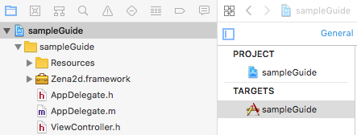
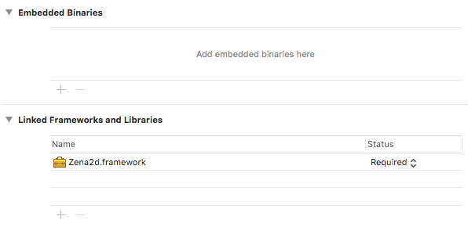
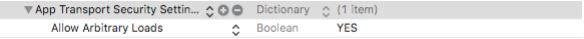
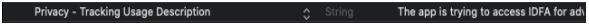
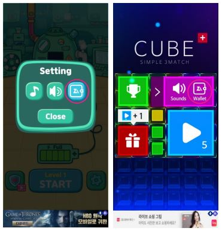

# iOS 연동가이드 &nbsp;<sub>[En](./README.md)</sub>&nbsp;<sub>[Ko](./README.ko.md)</sub>

1. [개요](#1-개요)

2. [제나애드 웹 콘솔에서 광고생성 및 광고 ID 가져오기](#2-제나애드-웹-콘솔에서-광고생성-및-광고-id-가져오기)

3. [SDK 설치](#3-sdk-설치)
    * 프로젝트 설정
    * Sample Guide

4. [퍼미션](#4-퍼미션)

5. [연동하기](#5-연동하기)
    * Import 및 Delegate 구현선언
    * SDK 초기화
    * 광고 준비요청
    * 광고 준비확인
    * 광고 보이기
    * 배너 위치 지정
    * 배너 제거
    * 제나애드 페이지 (가상자산)
    * 코드 샘플
    * Zena2dDelegate 콜백
    * 콜백 매개변수 목록
    * 서버응답 메시지 목록

6. [테스트 및 승인요청](#6-테스트-및-승인요청)
    * 테스트
    * 승인 요청방법

7. [추가정보](#7-추가정보)

<br/><br/><br/><br/><br/>

## 1. 개요
---
<br/>

* 실제 프로젝트 환경에 SDK 적용을 위한 가이드 문서입니다.

* iOS 9.0 이상의 환경에서 적용 가능하며 제나애드 웹 콘솔에서 발급받은 “광고 ID” 및 최신 SDK 가 별도로 필요합니다.

* 샘플 프로젝트 실행시에는 실제 발급받은 "광고 ID"로 수정 후 실행해야 합니다.

<br/><br/>

## 2. 제나애드 웹 콘솔에서 광고생성 및 광고 id 가져오기
---
<br/>

1. 앱 생성. (앱 관리 / 앱 생성)

2. 광고 생성. (광고 관리 / 광고 생성)

3. 생성된 광고에 "광고 ID"를 이용해 프로젝트 내에서 함수를 실행 할 수 있습니다.

<br/><br/>

## 3. sdk 설치
---
<br/>

.framework (iOS SDK) 파일과 sampleGuide 를 zip 로 압축하여 제공합니다.

* 프로젝트 설정

    1. zip 파일을 압축 해제하여 .framework 파일을 확인합니다.

    2. Xcode 를 실행 후 sdk 를 설치할 프로젝트를 열고 File -> Add Files to “…” -> .framework 파일을 선택하여 프로젝트에 포함합니다.

    3. 다시 한번 File -> Add Files to “…” 선택 후 이번에는 .framework 내부의 Resources 폴더를 선택하여 프로젝트에 포함합니다.

        

    4. 프로젝트 설정에서 TARGETS – General 탭을 선택후 아래쪽의 Linked Frameworks and Libraries 에 .framework 파일이 지정되어 있는지 확인합니다.   
    (static framework 이기 때문에 Embedded Binaries 에 지정되면 컴파일 오류가 발생합니다.)

        

    5. 이제 임포트 지정시 에러가 발생하지 않으면 준비과정이 정상적으로 적용된 것으로 sdk 를 사용할 수 있습니다. (#import "Zena2d/Zena2d.h")

* Sample Guide

    - sdk 가 설치된 샘플 프로젝트 입니다. 광고 ID 를 변경해 테스트 해보거나 코드사용 형태를 참고할 수 있습니다.

<br/><br/>

## 4. 퍼미션
---
<br/>

* 네트워크를 사용하기 위해 info.plist 파일에 아래의 키값을 추가, 변경이 필요합니다.

    

* iOS 14 이상에서는 IDFA 정책 변경으로 info.plist 파일에 아래의 키값이 필요합니다.   
(String : The app is trying to access IDFA for advertising purposes.)

    

<br/><br/>

## 5. 연동하기
---
<br/>

* Import 및 Delegate 구현선언
    ```objective-c
    #import "Zena2d/Zena2d.h"
    
    @interface ViewController : UIViewController <Zena2dDelegate>
    …
    @end
    ```
<br/>

* SDK 초기화
    ```objective-c
    - (void) Zena2d.init : (id<Zena2dDelegate>)delegate : (NSArray<NSString *>)ids;
    ```
<br/>

* 광고 준비요청
    ```objective-c
    - (void) Zena2d.readyAd : (NSInteger)product : (NSString *)medID;
    // Product : BANNER, INTERSTITIAL, VIDEO
    // medID : "BANNER ID or INTERSTITIAL ID or VIDEO ID"
    // (광고종류 : 배너광고, 전면광고, 동영상광고)
    ```
<br/>

* 광고 준비확인
    ```objective-c
    - (Boolean) Zena2d.isReadyAd : (NSInteger)product;
    // Product : BANNER, INTERSTITIAL, VIDEO
    // (광고종류 : 배너광고, 전면광고, 동영상광고)
    ```
<br/>

* 광고 보이기
    ```objective-c
    - (void) Zena2d.createAd : (NSInteger)product;
    // Product : BANNER, INTERSTITIAL, VIDEO
    // (광고종류 : 배너광고, 전면광고, 동영상광고)
    ```
<br/>

* 배너 위치 지정
    ```objective-c
    - (void) Zena2d.setBannerGravity: (NSInteger)mode;
    // Mode : BOTTOM, TOP
    // (배너위치 : 하단, 상단)
    ```
<br/>

* 배너 제거
    ```objective-c
    - (void) Zena2d.removeBanner;
    ```
<br/>

* 제나애드 페이지 (가상자산)

    유저에게 적립된 포인트를 확인/출금 할 수 있는 창으로 게임내 옵션창에 호출 가능한 메뉴를 제공해야 합니다.   
    메뉴의 모양 및 위치는 게임내 옵션창에 자유롭게 노출합니다. (적용 예시 하단에 첨부되어 있는 버튼 사용 가능)
    ```objective-c
    - (void) Zena2d.createPointWindow;
    ```
    <br/>

    - 적용 예시

        </img>

    <br/>

    - 버튼 다운로드
    
       <a href="https://github.com/zenaad/zenaadresources/blob/main/adIcon/wallet_c.png" target="_blank">
       </a>
       &nbsp;&nbsp;&nbsp;&nbsp;&nbsp;&nbsp;
       <a href="https://github.com/zenaad/zenaadresources/blob/main/adIcon/wallet_w.png" target="_blank">
       </a>
    
<br/>

* 코드 샘플

    - .h 파일

        ```objective-c
        #import <UIKit/UIKit.h>

        #import "Zena2d/Zena2d.h"

        @interface ViewController : UIViewController <Zena2dDelegate>
        …
        @end
        
        ```
        <br/>

    - .m 파일

        ```objective-c
        #import "ViewController.h"

        @interface ViewController ( )
        {
            @private
            Zena2d *zena2d;
        }
        @end


        @implementation ViewController
        - (void) viewDidLoad {
            [super viewDidLoad];
            
            NSArray<NSString *> ids = [NSArray arrayWithObjects :"BANNER ID", " INTERSTITIAL ID ", " VIDEO ID", nil]
            zena2d = [Zena2d getInstance];
            [zena2d setBannerGravity :BOTTOM];
            [zena2d init :self :ids];
        }


        //--------------------protocol--------------------//

        - (void) onInit :(Boolean)isInit :(NSString *)message {
            NSLog(@"onInit : %hhu : %@", isInit, message);
            //ex : 배너광고 준비
            if ( isInit ) [zena2d readyAd :BANNER :"BANNER ID"];
        }
        
        - (void) onSuccess :(NSInteger)product :(NSString *)message :(NSString *)detail {
            //미사용중
        }
        
        - (void) onError :(NSInteger)product :(NSString *)message :(NSString *)detail {
            NSLog(@"onError : %ld : %@ : %@", (long)product, message, detail);
        }
        
        - (void) onReady :(NSInteger)product :(Boolean)success :(NSString *)message {
            NSLog(@"onReady : %ld : %hhu : %@", (long)product, success, message);
            //ex : 광고 준비확인 및 생성
            if ([zena2d isReadyAd :product]) [zena2d createAd :product];
        }
        
        - (void) onCreate :(NSInteger)product :(Boolean)success :(NSString *)message {
            NSLog(@"onCreate : %ld : %hhu : %@", (long)product, success, message);
        }

        - (void) onReward :(NSInteger)product :(NSString *)reward :(NSInteger)count {
            NSLog(@"onReward : %ld : %@ : %li", (long)product, reward, (long)count);
        }
        
        - (void) onClick :(NSInteger)product {
            NSLog(@"onClick : %ld", (long)product);
        }
        
        - (void) onClose :(NSInteger)product :(NSString *)medID {
            NSLog(@"onClose : %ld : %@", (long)product, medID);
            //ex : 광고 닫힘과 동시에 다음 광고준비
            [zena2d readyAd :product :medID];
        }
        @end
        ```
    <br/>

* Zena2dDelegate 콜백

    |콜백|설명|
    |---|---|
    |onInit :(Boolean) :(NSString*) |[zena2d init]; -> SDK 초기화 후 성공여부를 알려줍니다.|
    |onSuccess :(NSInteger) :(NSString*) :(NSString*) |현재 미사용.|
    |onError :(NSInteger) :(NSString*) :(NSString*) |네트워킹 오류 및 응답 오류시 호출됩니다.|
    |onReady :(NSInteger) :(Boolean) :(NSString*) |[zena2d readyAd]; -> 광고요청, 광고로드를 진행하며 광고준비 성공여부를 알려줍니다.|
    |onCreate :(NSInteger) :(Boolean) :(NSString*) |[zena2d createAd]; -> 준비된 광고를 화면에 표시합니다.|
    |onReward :(NSInteger) :(NSString*) :(NSInteger) |보상형 광고의 보상조건 충족시 호출됩니다.|
    |onClick :(NSInteger) |광고 클릭시 호출됩니다.|
    |onClose :(NSInteger) :(NSString*) |광고 및 포인트 윈도우가 닫힐때 호출됩니다.|
<br/>

* 콜백 매개변수 목록

    |매개변수|설명|
    |---|---|
    |Boolean isInit |광고연동 준비상태.|
    |Boolean success |해당함수의 성공여부.|
    |NSString* message |응답에 대한 상태 및 메시지.|
    |NSString* detail |에러발생시 디테일 메시지.|
    |NSString* reward |보상형 광고에서 설정한 보상이름.|
    |NSString* medID |광고 준비시 전달한 medID.|
    |NSInteger product |광고 구분 - 0 or 1 or 2 (0 : BANNER, 1 : INTERSTITIAL, 2 : VIDEO)|
    |NSInteger count |보상형 광고에서 설정한 보상갯수.|
<br/>

* 서버응답 메시지 목록

    |메시지|설명|
    |---|---|
    |SUCCESS |성공.|
    |UNKNOWN |알 수 없는 에러입니다.|
    |UNKNOWN_MEDID |알 수 없는 미디어(광고) 아이디 입니다.|
    |AD_DISABLED |광고 비활성화 상태입니다. (웹콘솔 광고 관리에서 노출 중지 한 경우)|
    |AD_NOTFOUND |광고가 없습니다.|
    |AD_EXPIRED |준비된 광고가 만료되었습니다. ReadyAd( )가 필요합니다.|
    |ALREADY_ADREQ |중복된 광고 요청입니다. – sdk 에러.|
    |EXCEEDED_IMPRESSION |노출횟수가 초과 되었습니다. (웹콘솔 광고 관리에서 노출 횟수를 설정한 경우)|

<br/><br/>

## 6. 테스트 및 승인요청
---
<br/>

* 테스트

    - 아래와 같은 제나애드 기본광고가 노출되면 정상입니다.

        |타입|보기|
        |:---:|:---:|
        |배너 |</img>|
        |전면 |</img>|
        |비디오 |</img>|
<br/>

* 승인 요청방법

    - 출시 직전이나 출시 후 승인 요청하면 실제광고가 노출되고 정산됩니다.

    - 다음은 승인요청 메일 예시입니다.   
    <br/>
    수신 : help@zenaad.com <br/>
    내용 : 제나애드 계정 이메일 (필수) : 예) publisher@zenaad.com <br/>
    &nbsp;&nbsp;&nbsp;&nbsp;&nbsp;&nbsp; 회사명 (필수) : 예) (주)제나애드 <br/>
    &nbsp;&nbsp;&nbsp;&nbsp;&nbsp;&nbsp; 앱 이름 (필수) : 될 수 있으면 스토어에서 검색 가능한 이름 <br/>
    &nbsp;&nbsp;&nbsp;&nbsp;&nbsp;&nbsp; 스토어 주소 (선택) : 유효한 URL 주소

<br/><br/>

## 7. 추가정보
---
<br/>

* Zena2D 에서는 광고식별자 (ADID, IDFA)를 활용하며 리소스의 효율적인 사용을 위해 캐쉬 데이터를 저장합니다. (최대 256MB)

<br/><br/>
