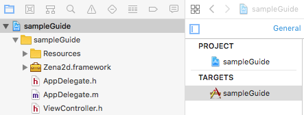
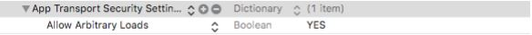

# iOS GUIDE &nbsp;<sub>[En](./README.md)</sub>&nbsp;<sub>[Ko](./README.ko.md)</sub>

1. [Overview](#1-overview)

2. [Create an ad in the Zenaad web console and add an Ad ID](#2-create-an-ad-in-the-zenaad-web-console-and-add-an-ad-id)

3. [SDK Installation](#3-sdk-installation)
    * Project Setting
    * Sample Guide

4. [Permission](#4-permission)

5. [Link](#5-link)
    * Import and Delegate Implementation Declarations
    * Initialize SDK
    * Request AD ready
    * Confirm ad ready
    * Show Ad
    * Position the banner
    * Remove banner
    * Code Sample
    * Zena2dDelegate Callback
    * Callback Parameter List
    * Server Response Message List

6. [Test and Approval Request](#6-test-and-approval-request)
    * Test
    * Requesting Approva

7. [Additional Information](#7-additional-information)

<br/><br/><br/><br/><br/>

## 1. overview
---
<br/>

* This document details how to apply SDK to a real project.

* SDK is compatible with iOS 9.0 +. The ZenaAD Ad ID and latest SDK from the web console must be obtained separately.

* When running the sample project, run after editing in the issued Ad ID.

<br/><br/>

## 2. create an ad in the zenaad web console and add an ad id
---
<br/>

1. Create an App. (App Management/App Creation)

2. Create an Ad. (Ad Management/Ad Creation)

3. Functions can be run within your project using the Ad ID in the generated ad.

<br/><br/>

## 3. sdk installation
---
<br/>

A Compressed zip file containing a sampleGuide and .framework (iOS SDK) is provided.

* Project Setting

    1. Unzip the zip file to see the .framework file.

    2. Run Xcode to open your project and select File -> Add Files to “…” -> .framework file to include in the project.

    3. Once again go to File -> Add Files to "... "And then select the Resources folder inside the .framework to include it in the project.

        

    4. Select Project, select the TARGETS - General tab, and make sure that the .framework file is specified at the bottom of Linked Frameworks and Libraries.   
    (Because it is a static framework, compilation errors will occur if specified in Embedded Binaries.)

        

    5. Now, if you do not get an error when you specify an import, you can use sdk. (#import "Zena2d/Zena2d.h")

* Sample Guide

    - This is a sample project with sdk installed. You can change your ad ID to test it, or you can refer to the code usage pattern.

<br/><br/>

## 4. permission
---
<br/>

* To use the network, you need to add and change the following key value in info.plist file.

    

* In iOS 14 or later, the following key values are required in the info.plist file due to IDFA policy change.   
(String : The app is trying to access IDFA for advertising purposes.)

    

<br/><br/>

## 5. link
---
<br/>

* Import and Delegate Implementation Declarations
    ```objective-c
    #import "Zena2d/Zena2d.h"
    
    @interface ViewController : UIViewController <Zena2dDelegate>
    …
    @end
    ```
<br/>

* Initialize SDK
    ```objective-c
    - (void) Zena2d.init : (id<Zena2dDelegate>)delegate : (NSArray<NSString *>)ids;
    ```
<br/>

* Request AD ready
   ```objective-c
    - (void) Zena2d.readyAd : (NSInteger)product : (NSString *)medID;
    // Product : BANNER, INTERSTITIAL, VIDEO
    // medID : "BANNER ID or INTERSTITIAL ID or VIDEO ID"
    // (Ad types : Banner Ad, Full-screen Ad, Video Ad)
    ```
<br/>

* Confirm ad ready
    ```objective-c
    - (Boolean) Zena2d.isReadyAd : (NSInteger)product;
    // Product : BANNER, INTERSTITIAL, VIDEO
    // (Ad types : Banner Ad, Full-screen Ad, Video Ad)
    ```
<br/>

* Show Ad
    ```objective-c
    - (void) Zena2d.createAd : (NSInteger)product;
    // Product : BANNER, INTERSTITIAL, VIDEO
    // (Ad types : Banner Ad, Full-screen Ad, Video Ad)
    ```
<br/>

* Position the banner
    ```objective-c
    - (void) Zena2d.setBannerGravity: (NSInteger)mode;
    // Mode : BOTTOM, TOP
    // (Banner Position : Bottom, Top)
    ```
<br/>

* Remove banner
    ```objective-c
    - (void) Zena2d.removeBanner;
    ```
<br/>

* Code Sample

    - .h File

        ```objective-c
        #import <UIKit/UIKit.h>

        #import "Zena2d/Zena2d.h"

        @interface ViewController : UIViewController <Zena2dDelegate>
        …
        @end
        
        ```
        <br/>
    
    - .m File

        ```objective-c
        #import "ViewController.h"

        @interface ViewController ( )
        {
            @private
            Zena2d *zena2d;
        }
        @end


        @implementation ViewController
        - (void) viewDidLoad {
            [super viewDidLoad];
            
            NSArray<NSString *> ids = [NSArray arrayWithObjects :"BANNER ID", " INTERSTITIAL ID ", " VIDEO ID", nil]
            zena2d = [Zena2d getInstance];
            [zena2d setBannerGravity :BOTTOM];
            [zena2d init :self :ids];
        }


        //--------------------protocol--------------------//

        - (void) onInit :(Boolean)isInit :(NSString *)message {
            NSLog(@"onInit : %hhu : %@", isInit, message);
            //ex : Banner Ad Ready
            if ( isInit ) [zena2d readyAd :BANNER :"BANNER ID"];
        }
        
        - (void) onSuccess :(NSInteger)product :(NSString *)message :(NSString *)detail {
            //Not in use
        }
        
        - (void) onError :(NSInteger)product :(NSString *)message :(NSString *)detail {
            NSLog(@"onError : %ld : %@ : %@", (long)product, message, detail);
        }
        
        - (void) onReady :(NSInteger)product :(Boolean)success :(NSString *)message {
            NSLog(@"onReady : %ld : %hhu : %@", (long)product, success, message);
            //ex : Banner Ad creation and check ready
            if ([zena2d isReadyAd :product]) [zena2d createAd :product];
        }
        
        - (void) onCreate :(NSInteger)product :(Boolean)success :(NSString *)message {
            NSLog(@"onCreate : %ld : %hhu : %@", (long)product, success, message);
        }

        - (void) onReward :(NSInteger)product :(NSString *)reward :(NSInteger)count {
            NSLog(@"onReward : %ld : %@ : %li", (long)product, reward, (long)count);
        }
        
        - (void) onClick :(NSInteger)product {
            NSLog(@"onClick : %ld", (long)product);
        }
        
        - (void) onClose :(NSInteger)product :(NSString *)medID {
            NSLog(@"onClose : %ld : %@", (long)product, medID);
            //ex : Close ad while preparing for next ad
            [zena2d readyAd :product :medID];
        }
        @end
        ```
    <br/>

* Zena2dDelegate Callback

    |Callback|Description|
    |---|---|
    |onInit :(Boolean) :(NSString*) |[zena2d init]; -> Initializes SDK and indicates if successful.|
    |onSuccess :(NSInteger) :(NSString*) :(NSString*) |Currently unused.|
    |onError :(NSInteger) :(NSString*) :(NSString*) |Called on network errors and response errors.|
    |onReady :(NSInteger) :(Boolean) :(NSString*) |[zena2d readyAd]; -> Processes an ad request, loads the ad, and indicates if the ad is ready.|
    |onCreate :(NSInteger) :(Boolean) :(NSString*) |[zena2d createAd]; -> Displays prepared ad.|
    |onReward :(NSInteger) :(NSString*) :(NSInteger) |Called when the reward conditions for compensating ads are met.|
    |onClick :(NSInteger) |Called when an ad is clicked.|
    |onClose :(NSInteger) :(NSString*) |Invoked when the ad and point windows are closed.|
<br/>

* Callback Parameter List

    |Parameter|Description|
    |---|---|
    |Boolean isInit |Ad ready status.|
    |Boolean success |Function success/failure.|
    |NSString* message |Response status and messages.|
    |NSString* detail |Detailed error message.|
    |NSString* reward |Name of the reward entered for a compensating ad.|
    |NSString* medID |The medID sent when preparing an ad.|
    |NSInteger product |Ad Category - 0 or 1 or 2 (0 : BANNER, 1 : INTERSTITIAL, 2 : VIDEO)|
    |NSInteger count |The reward count set for a compensating ad.|
<br/>

* Server Response Message List

    |Message|Description|
    |---|---|
    |SUCCESS |Success.|
    |UNKNOWN |Unknown Error.|
    |UNKNOWN_MEDID |Unknown Media (Ad) ID.|
    |AD_DISABLED |Ad is currently disabled. (If broadcast is stopped in the Web Console Ad Management)|
    |AD_NOTFOUND |There is no ad.|
    |AD_EXPIRED |The prepared Ad has expired. ReadyAd( ) needed.|
    |ALREADY_ADREQ |Duplicate Ad request. – sdk error.|
    |EXCEEDED_IMPRESSION |Exposure limit exceeded. (If exposure count is set in the Web Console Ad Management)|

<br/><br/>

## 6. test and approval request
---
<br/>

* Test

    - If the following ZenaAD native ads are displayed, then the system is running normally.

        |Type|Example|
        |:---:|:---:|
        |Banner |</img>|
        |Full-screen |</img>|
        |Video |</img>|
<br/>

* Requesting Approval

    - Requesting approval immediately before or after launch will broadcast your ad and accumulate balance.

    - Here is an example of an approval request email:   
    <br/>
    Contents : help@zenaad.com <br/>
    Company Info : ZenaAD account email (required): ex) publisher@zenaad.com <br/>
    &nbsp;&nbsp;&nbsp;&nbsp;&nbsp;&nbsp; Company Name (required): ex) ZenaAD Co., Ltd. <br/>
    &nbsp;&nbsp;&nbsp;&nbsp;&nbsp;&nbsp; App Name (required):  A searchable name in the Store, if <br/>
    &nbsp;&nbsp;&nbsp;&nbsp;&nbsp;&nbsp; Store Address (optional): Valid URL Address

<br/><br/>

## 7. additional information
---
<br/>

*  ZenaAD uses ad identifiers (ADID, IDFA) and saves cash data for efficient resource use. (Up to 256 MB)

<br/><br/>
